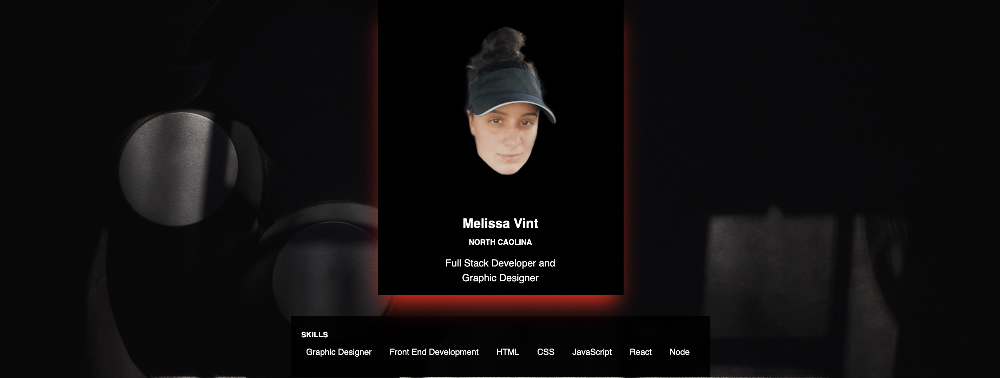
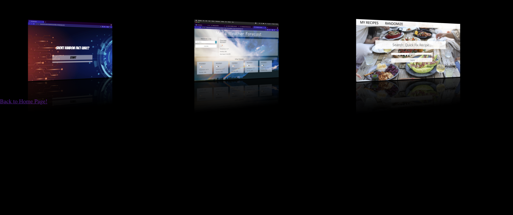

# Portfolio-Mel-upgraded
Step by Step 

## Table of Contents

1.[Description](#Description)

2.[Screen Shots](#Screenshots)

3.[License](#License)

4.[Usage](#Usage)

5.[Badges](#Badges)

## Description
In the works of a portfolio!
## Screenshots

=======

## License
(MIT)

## Usage

## Badges
(HTML, Style.CSS)

